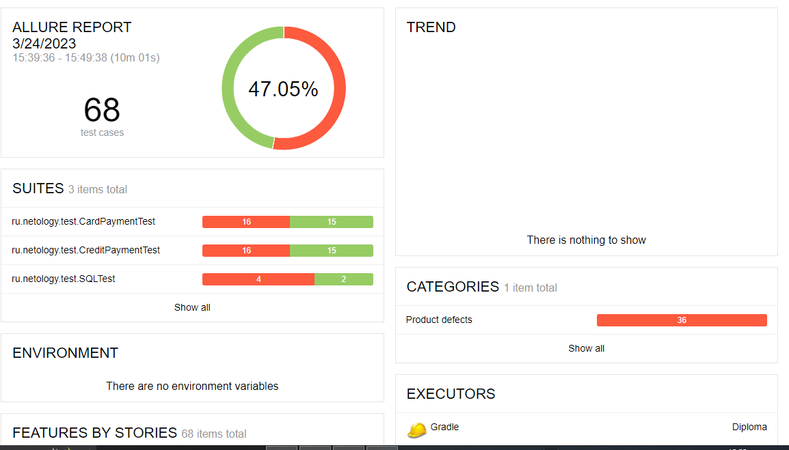

# Отчет по итогам тестирования

# Краткое описание

Была проведена автоматизация тестирования комплексного веб-сервиса по покупке тура, взаимодействующего с СУБД и API Банка. Были протестированы два способа покупки тура: с помощью обычной оплаты по дебетовой банковской карте и с помощью выдачи кредита по данным банковской карты во взаимодействии с симулятором банковских сервисов, а также корректность внесения информации об оплате в СУБД сервиса с помощью MySQL и PostgreSQL. Таким образом, были протестированы позитивные и негативные сценарии UI приложения, а также корректность внесения информации приложением в базу данных.

# Тест-кейсы
Всего было выполнено 68 тест-кейсов, из которых 32 успешны, 36 - неуспешны, таким образом процент успешных тест-кейсов составляет 47,05%, неуспешных - 52,95%.
Из 5 позитивных тест-кейсов с использованием карты, для которой задан статус APPROVED, все UI-тесты прошли успешно и для вкладки "Купить", и для вкладки "Купить в кредит". Но карта, для которой задан статус DECLINED, не отклоняется сервисом, что подтверждается также тестами на запросы в базу данных с использованием и MySQL, и PostgreSQL, для обеих вкладок. При этом, если ввести в поле "Номер карты" рандомные 16 цифр, в базу заносится статус APPROVED.
Среди негативных тест-кейсов в основном были неуспешными тесты на валидацию полей, а также на корректность указания ошибок при заполнении полей.
В ходе тестирования валидации поля "CVC/CVV" был обнаружен дефект, заключающийся в том, что при отсуствии значения в поле "CVC/CVV", дополнительно появляется ошибка под полем "Владелец", даже если оно заполнено. Данный дефект отражен в Issues, но отдельного тест-кейса не него нет.

# Общие рекомендации

1. Доработка тестовых данных карт, взаимодействия с симулятором банковских сервисов в части генерации предопределенных ответов об успешности/неуспешности оплаты, а также сохранения данного статуса в БД сервиса.
2. Доработка валидации полей, в частности поля "Владелец", так как оно принимает кириллицу и любые символы, а также нигде не прописано ограничение по длине данных, которые можно внести в это поле.
3. Доработка текста ошибок, которые появляются под полями при внесении неверных/отсутствии данных.
4. На главной странице есть орфографическая ошибка, так как название города Марракеш пишется через "е", а не через "э" (в Issues не указано).
